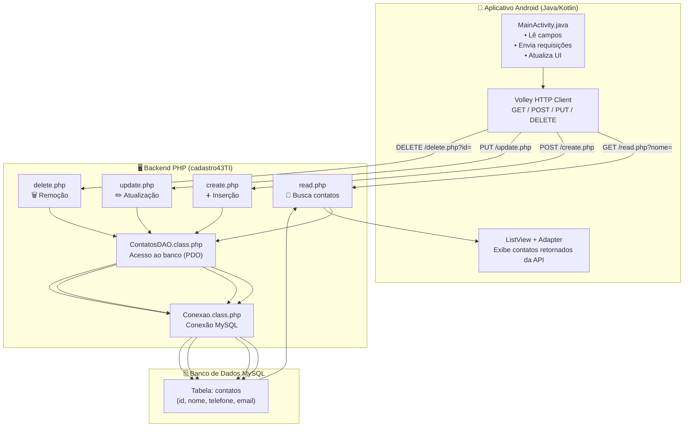

# 📱 Aplicativo TestarAPI – Android (Java/Kotlin)

Este repositório contém o aplicativo **TestarAPI**, desenvolvido no **Android Studio** utilizando **Java** e partes em **Kotlin**, criado para consumir uma API REST desenvolvida no projeto abaixo:

👉 **API Backend (PHP + MySQL):**  
https://github.com/ricardaoquadros-jpg/cadastro43TI

O objetivo do app é permitir testes reais de requisições HTTP (GET, POST, UPDATE, DELETE) usando **Android + Volley**, consumindo dados do backend feito em Visual Code.

O desenvolvimento foi assistido e refinado com **ChatGPT 5.1** e **Gemini 3 Pro**, permitindo implementação mais rápida, organização de fluxo e correção de bugs.

---

## 🚀 Funcionalidades do Aplicativo

- 📡 Consumo da API via **Volley**
- 🔍 Busca de contatos por nome  
- 📋 Listagem dos registros retornados pela API  
- ➕ Inserção de novos dados (via endpoint)  
- ✏️ Atualização de entradas  
- 🗑 Exclusão de registros  
- 📱 Interface simples e funcional em XML  
- 🌐 Conexão direta com banco MySQL através da API PHP  

---

## 🛠 Tecnologias Utilizadas

### **Android / Mobile**
- Java  
- Kotlin  
- Android Studio  
- XML Layouts  
- Volley HTTP Client  

### **Backend (API Associada)**
> Repositório relacionado: https://github.com/ricardaoquadros-jpg/cadastro43TI  
- PHP  
- MySQL  
- PDO  
- Rotas REST (GET / POST / PUT / DELETE)  

### **Ferramentas que auxiliaram o desenvolvimento**
- ChatGPT 5.1 (auxílio em código, refatoração e arquitetura)  
- Gemini 3 Pro (refinamento de fluxos e correções)  
- Git & GitHub  

## 🧩 Arquitetura do Sistema

---

## 📁 Estrutura do Projeto (Resumo)

testarAPI/

├─ app/src/main/java/com/example/testarapi/

│ ├─ MainActivity.java

│ ├─ models/

│ ├─ adapters/

│ └─ utils/

├─ res/

│ ├─ layout/

│ │ ├─ activity_main.xml

│ │ └─ item_lista.xml

│ ├─ values/

│ └─ drawable/

├─ AndroidManifest.xml

├─ build.gradle

└─ README.md|

---

## 🔗 Conexão com a API

O aplicativo se conecta diretamente ao backend hospedado em servidor local (XAMPP) ou rede interna, consumindo endpoints como:

GET /view/read.php?nome=

POST /view/create.php

PUT /view/update.php

DELETE /view/delete.php?id=

Toda estrutura está disponível no repositório:  
➡ https://github.com/ricardaoquadros-jpg/cadastro43TI

## 🧑‍💻 Autor

**Ricardo Quadros**  
- Estudante de Engenharia da Computação na UERGS  
- Técnico em Informática na Dr. Solon Tavares 
- Estagiário de Tecnologia e Informação – Prefeitura de Guaíba  
- Guaíba, RS – Brasil

---

## 📫 Contato

- GitHub: https://github.com/ricardaoquadros-jpg  
- Email: ricardaoquadros@gmail.com
- Linkedin: https://www.linkedin.com/in/ricardopquadros/
